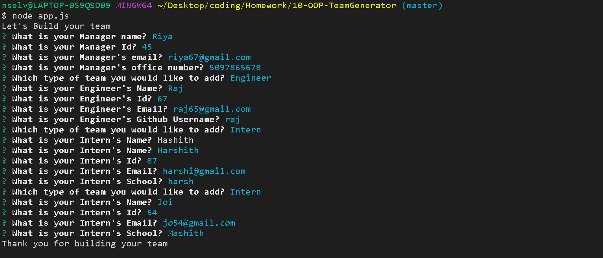
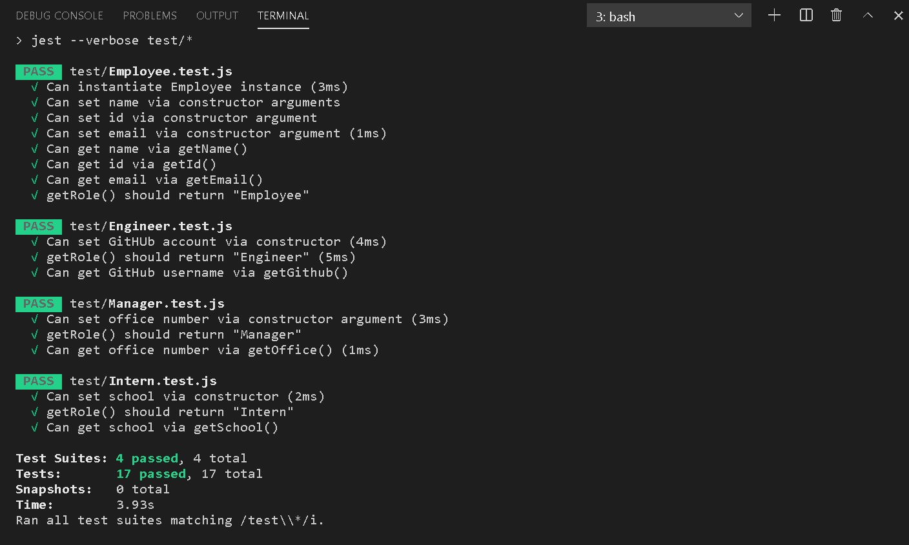
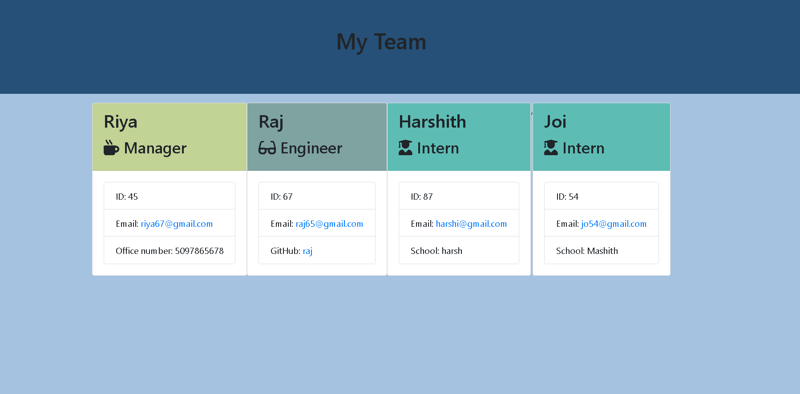

## Unit 10 OOP Homework: Template Engine - Employee Summary

The purpose of this project is to build a Node CLI that takes in information about employees and generates an HTML webpage that displays the collected details. This team generator command line application  prompts the user for information about the team manager and the team members. This is completely a Test-driven development(TDD) using [Jest Testing](https://jestjs.io/docs/en/manual-mocks) where requirements are turned into very specific test cases, then the code is improved so that the tests pass.

### User Story 

```
As a manager
I want to generate a webpage that displays my team's basic info
so that I have quick access to emails and GitHub profiles
```

### Prerequisite

To execute the generate readme application, the user must first install node.js.

Steps to Install NodeJS: [Node.js Installation](https://docs.npmjs.com/downloading-and-installing-node-js-and-npm#windows-node-version-managers)

After installing node.js

To install NPM module dependencies, run the command:

```
npm install
```

The application will be invoked with the following command:

```
node app.js
```

To run the test, use the following command:

```
npm test
```

### Node.js Built-in Package

* fs -  Used fs.writeFileSync method to write to the file

* path - Used path.resolve, path.join method to deal with file paths


### NPM Module

* Inquirer - Used the inquirer.prompt method to prompt the user with questions regarding the employees. Validate attribute in the inquirer module is used in order to ensure each questions was answered correctly.

* axios    -  Used axios.get method for github account validation.

### Preview






### Submission Links

Link To the GitHub Repo : https://github.com/YakiniA/10-OOP-TeamGenerator

Link To the generated team.html file: [HTML File](output/team.html)

Link To The Demo Video : https://drive.google.com/file/d/1SZoYuFZToXFrYFs9i5rRVorCQDX7woig/view?usp=sharing

##### References

StackOverflow : [StackOverflow - Inquirer validation](https://stackoverflow.com/questions/57321266/how-to-test-inquirer-validation)<br/>
StackOverflow : [StackOverflow - Email validation](https://stackoverflow.com/questions/46155/how-to-validate-an-email-address-in-javascript)<br/>
Jest Testing : [Jest](https://jestjs.io/docs/en/manual-mocks)